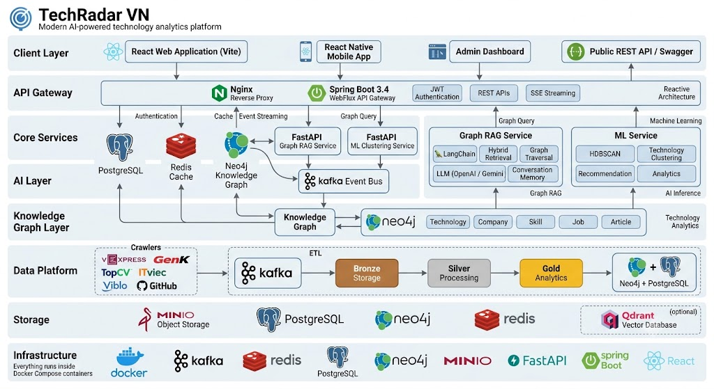
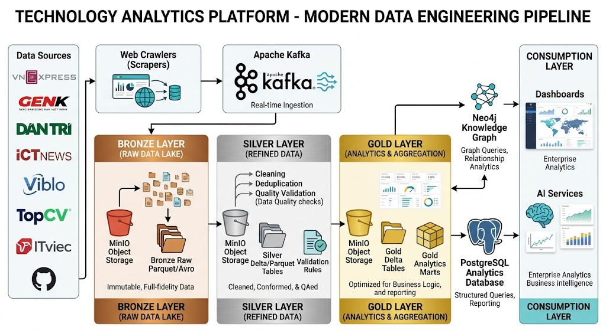
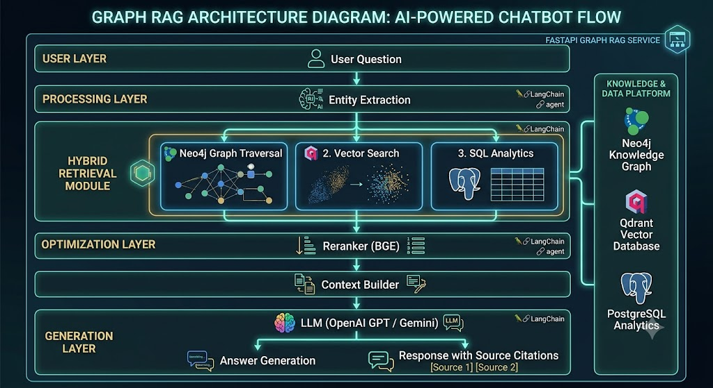

# TechRadar VN

<div align="center">

  
  
  
  
  
  
  
  
  

  **Technology Trend Analytics Platform powered by Knowledge Graph, Graph RAG and Machine Learning**

  [Documentation](docs/README.md) • [API Docs](docs/API_DOCs_v1.md) • [Architecture](docs/ARCHITECTURE.md) • [Deployment](docs/DEPLOYMENT.md)

</div>

---

## Mục lục

- [Giới thiệu](#gioi-thieu)
- [Tính năng chính](#tinh-nang-chinh)
- [Kiến trúc hệ thống](#kien-truc-he-thong)
- [Data Pipeline](#data-pipeline)
- [Graph RAG](#graph-rag)
- [Knowledge Graph](#knowledge-graph)
- [Tech Stack](#tech-stack)
- [Cấu trúc dự án](#cau-truc-du-an)
- [Bắt đầu](#bat-dau)
- [Kiểm thử](#kiem-thu)
- [Tài liệu](#tai-lieu)
- [Roadmap](#roadmap)
- [Liên hệ](#lien-he)
- [Acknowledgments](#acknowledgments)
- [Star History](#star-history)

---

<a id="gioi-thieu"></a>
## 📖 Giới thiệu

**TechRadar VN** là nền tảng phân tích xu hướng công nghệ và thị trường tuyển dụng IT tại Việt Nam, sử dụng kết hợp **Knowledge Graph**, **Graph RAG** và **Machine Learning** để cung cấp insights thực tế cho developers, recruiters và decision-makers.

### 🎯 Vấn đề giải quyết

- **Developers**: Không biết công nghệ nào đang hot, nên học gì để tăng cơ hội việc làm
- **Recruiters**: Khó xác định kỹ năng cần thiết, mức lương thị trường
- **Decision-makers**: Thiếu dữ liệu để ra quyết định về training, hiring, technology adoption

### 💡 Giải pháp

TechRadar VN thu thập dữ liệu từ các nguồn tin công nghệ và tuyển dụng IT tại Việt Nam, sử dụng NLP để trích xuất thực thể, xây dựng Knowledge Graph trên Neo4j, sau đó cung cấp:

- **Trend Analytics**: Theo dõi xu hướng công nghệ theo thời gian
- **Knowledge Graph Explorer**: Khám phá mối liên hệ giữa công nghệ, kỹ năng, doanh nghiệp
- **Graph RAG Chatbot**: Hỏi đáp trên dữ liệu thực tế với nguồn tham chiếu
- **Technology Clustering**: Phân cụm công nghệ tương đồng
- **Career Assistant**: Định hướng học tập và nghề nghiệp

### 🌟 Điểm khác biệt

- **Dữ liệu thực tế**: Thu thập từ các nguồn Việt Nam (VNExpress, GenK, TopCV, ITviec, v.v.)
- **Knowledge Graph**: Mối quan hệ sâu giữa công nghệ, kỹ năng, doanh nghiệp, việc làm
- **Graph RAG**: Hỏi đáp chính xác hơn với context từ graph
- **Real-time**: Cập nhật dữ liệu liên tục từ crawlers
- **Vietnam-focused**: Tối ưu cho thị trường Việt Nam

---

<a id="tinh-nang-chinh"></a>
## ✨ Tính năng chính

### � Trend Radar Dashboard

Theo dõi xu hướng công nghệ theo thời gian với dashboard trực quan.

- **Top Technologies**: Xem top công nghệ theo mức tăng trưởng YoY, MoM
- **Job Analytics**: Thống kê số lượng việc làm theo công nghệ
- **Growth Metrics**: Tỷ lệ tăng trưởng, số bài viết, số việc làm
- **Export**: Xuất dữ liệu dưới dạng PNG, CSV
- **Time Series**: Xem xu hướng theo thời gian (6 tháng, 12 tháng)

**Use Case**: Developer muốn biết React có đang tăng trưởng không, có bao nhiêu việc làm React hiện tại.

---

### 🕸 Knowledge Graph Explorer

Trực quan hóa và khám phá đồ thị tri thức với force-directed graph.

- **Interactive Graph**: Zoom, pan, drag nodes, filter edges
- **Entity Types**: Technology, Company, Job, Skill, Article, Location
- **Relationships**: MENTIONS, REQUIRES, USES, RELATED_TO, POSTED_BY
- **Graph Traversal**: Tìm đường đi ngắn nhất giữa 2 công nghệ
- **Advanced Filtering**: Lọc theo location, salary, sentiment, node types
- **Node Details**: Xem chi tiết thông tin từng node
- **Graph Analytics**: Chế độ tô màu công nghệ theo cộng đồng (Louvain) + resize theo mức độ trung tâm (PageRank), tính bằng Neo4j GDS (`POST /admin/graph-analytics/rebuild`, admin-triggered)

**Use Case**: Developer muốn biết React có liên quan đến những công nghệ nào, những công ty nào đang dùng React.

---

### 🤖 Graph RAG Chatbot

Chatbot hỏi đáp thông minh trên dữ liệu thực tế với Graph RAG.

- **Multi-Source Retrieval**: Kết hợp vector search, graph traversal, SQL analytics, user context
- **Reranking**: BGE reranker để cải thiện relevance
- **Streaming Response**: Real-time streaming cho trải nghiệm tốt hơn
- **Source Citations**: Trả lời có nguồn tham chiếu (articles, jobs)
- **Conversation Memory**: Lưu lịch sử hội thoại theo session
- **Entity Extraction**: Tự động trích xuất entities từ câu hỏi

**Use Case**: Developer hỏi "React developer ở Việt Nam lương bao nhiêu?", chatbot trả lời với số liệu từ jobs và articles.

---

### 🧠 Technology Clustering

Phân cụm công nghệ tương đồng bằng Machine Learning.

- **HDBSCAN Clustering**: Density-based clustering cho các cluster có kích thước khác nhau
- **Feature Engineering**: Alias normalization, name embedding, graph features, job TF-IDF
- **LLM Labeling**: Tự động đặt tên cluster bằng LLM
- **Coherent Clusters**: Chỉ hiển thị clusters chất lượng cao
- **Batch Prediction**: Dự đoán cluster cho nhiều công nghệ cùng lúc
- **Visualization**: Visualize clusters trên 2D space

**Use Case**: Developer muốn biết React thuộc nhóm nào, có những công nghệ nào tương tự.

---

### ⚖️ Technology Comparison

So sánh chi tiết giữa các công nghệ.

- **Side-by-Side Comparison**: So sánh growth rate, job count, article count
- **Time Series Comparison**: So sánh xu hướng theo thời gian
- **LLM Summary**: Tóm tắt so sánh bằng LLM
- **Similarity Score**: Điểm tương đồng giữa các công nghệ

**Use Case**: Developer đang phân vân giữa React và Vue, muốn so sánh chi tiết.

---

### 🚀 Career Assistant

Định hướng học tập và nghề nghiệp cá nhân hóa.

- **Skill Gap Analysis**: Phân tích thiếu hụt kỹ năng
- **Learning Path**: Đề xuất lộ trình học tập
- **Salary Insights**: Thông tin lương theo kỹ năng, location
- **Career Roadmap**: Lộ trình phát triển nghề nghiệp

**Use Case**: Developer muốn biết từ Junior Frontend nên học gì để trở thành Senior Full-stack.

---

### 💼 Job Matching

Gợi ý việc làm phù hợp với hồ sơ, dựa trên đồ thị tri thức (Neo4j).

- **Skill-based Ranking**: Xếp hạng job theo tỷ lệ khớp kỹ năng hồ sơ (`matched_skills` / `missing_skills`)
- **Location & Salary Filter**: Lọc theo địa điểm và mức lương tối thiểu (parse lương free-text tiếng Việt)

**Use Case**: Developer có kỹ năng Java/Spring Boot muốn xem ngay những job đang tuyển khớp nhất với mình.

---

### 🏢 Company Explorer

Khám phá công ty và tech stack thực tế của họ, suy luận từ dữ liệu job posting trên đồ thị tri thức.

- **Company Directory**: Danh sách công ty xếp hạng theo số lượng job đang tuyển
- **Similar Companies**: Gợi ý công ty có tech stack tương đồng (Jaccard similarity)
- **AI Company Insight**: Tóm tắt ngắn bằng AI về hồ sơ tuyển dụng/tech stack công ty (`/company-insight`, public — hiển thị ngay trên trang Company Explorer không cần đăng nhập)

**Use Case**: Developer muốn biết công ty nào đang dùng stack giống công ty mình đang cân nhắc ứng tuyển.

---

### 🎤 AI Mock Interview

Phỏng vấn thử với AI, có ngữ cảnh từ job posting thật trên đồ thị tri thức.

- **Grounded Questions**: Câu hỏi mở đầu dựa trên 1 job posting thật khớp vị trí/công ty mục tiêu
- **Turn-based Feedback**: Mỗi câu trả lời được AI chấm điểm + hỏi tiếp câu tiếp theo
- **Final Assessment**: Kết thúc buổi phỏng vấn với điểm số (0-10) và nhận xét tổng kết

**Use Case**: Developer chuẩn bị phỏng vấn vị trí Senior Backend Developer, luyện tập trả lời trước với AI.

---

### 📰 Social Feed

Mạng xã hội nội bộ để chia sẻ và kết nối với developer khác.

- **Feed**: Đăng bài, xem bài của bản thân + người đang follow
- **Like & Comment**: Tương tác trên bài đăng — tác giả nhận notification realtime khi có like/comment mới
- **Follow**: Theo dõi người dùng khác, gợi ý người nên follow — nhận notification khi có follower mới
- **Public Profile**: Trang hồ sơ công khai với follower/following/post count
- **Report vi phạm**: Báo cáo bài viết/bình luận, admin duyệt qua hàng đợi kiểm duyệt riêng

**Use Case**: Developer chia sẻ một mẹo học React và nhận phản hồi từ cộng đồng trong app.

---

### 💬 Direct Messaging

Nhắn tin trực tiếp 1-1 giữa người dùng, realtime qua SSE (fan-out qua Redis Pub/Sub — hoạt động đúng dù backend chạy nhiều instance).

- **1-1 Conversations**: Danh sách hội thoại, mới nhất trước
- **Realtime Delivery**: Tin nhắn mới đẩy trực tiếp qua SSE (không cần refresh)
- **Read Receipts**: Đánh dấu đã đọc, badge số tin nhắn chưa đọc
- **Notification**: Nhận thông báo tin nhắn mới ngay cả khi không đang mở trang Tin nhắn

**Use Case**: Developer nhắn tin trực tiếp cho tác giả một bài đăng hoặc một gợi ý kết nối.

---

### 👤 User Management

Quản lý tài khoản và hồ sơ cá nhân.

- **Authentication**: JWT với refresh token rotation; token bị vô hiệu hoá ngay lập tức (security stamp) khi admin đổi role/khoá tài khoản, không phải chờ token hết hạn
- **Profile Management**: Quản lý thông tin cá nhân, avatar
- **Technology Preferences**: Đăng ký công nghệ quan tâm
- **Notification Settings**: Bật/tắt thông báo in-app và email
- **Subscription Tiers**: FREE, PRO, ENTERPRISE với các tính năng khác nhau

---

### 🔔 Notifications

Hệ thống thông báo realtime, fan-out qua Redis Pub/Sub nên đúng dù chạy nhiều instance backend.

- **Trend Alerts**: Thông báo khi công nghệ quan tâm tăng trưởng vượt threshold (in-app + email)
- **Job Match Alerts**: Thông báo khi có job mới khớp kỹ năng hồ sơ (in-app + email)
- **Social & Messaging**: Thông báo khi có người like/comment bài viết, follow bạn, hoặc gửi tin nhắn (chỉ in-app, không email)
- **Real-time Streaming**: SSE để push notification realtime
- **Notification Center**: Quản lý và đánh dấu đã đọc

---

<a id="kien-truc-he-thong"></a>
## 🏗 Kiến trúc hệ thống

### High-Level Architecture

<div align="center">



*Client → Nginx + Spring Boot WebFlux → Graph RAG / ML · Neo4j Knowledge Graph · Medallion ETL (Bronze → Silver → Gold) · Docker Compose*

</div>

Chi tiết: [Architecture](docs/ARCHITECTURE.md).

### Backend Architecture

Backend được xây dựng với **Spring Boot 3.4** theo mô hình **Hexagonal Architecture (Ports & Adapters)** kết hợp **Feature-Based Modular Architecture**.

**Design Principles:**
- Hexagonal Architecture: Domain logic độc lập với infrastructure
- Dependency Inversion: High-level modules không phụ thuộc low-level modules
- Domain-Driven Design: Bounded contexts theo feature
- Feature-Based Modularization: Mỗi feature là một module độc lập
- Reactive Programming: WebFlux + R2DBC cho non-blocking I/O

**Feature Modules:**
- `auth`: Authentication & Authorization (JWT, refresh rotation)
- `radar`: Trend Analytics, export PNG/CSV
- `compare`: Technology Comparison
- `graph`: Knowledge Graph Explorer
- `chat`: RAG Chatbot proxy (`ai-rag-core`)
- `clustering`: Technology Clustering proxy (`ml-clustering`)
- `salary`: Salary Insights (Neo4j)
- `notification`: In-app / email alerts, SSE stream, trend & job-match dispatch
- `company`: Company Explorer (Neo4j)
- `job`: Job Matching theo skill overlap (Neo4j)
- `roadmap`: Career Roadmap + "what-if" skill simulation (`GET /career/roadmap`, `/career/simulate`), cache Redis riêng, alert khi có lộ trình mới phù hợp
- `messaging`: Direct messages 1-1 (Postgres + SSE qua Redis Pub/Sub)
- `social`: Feed / follow / like / comment / content report
- `aiproxy`: Forward career / forecast / recommend / report / interview / agent / summarize → `ai-rag-core`
- `user`: User Management, profile, avatar, preferences
- `system`: Settings, admin dashboard, activity log, CMS, health/status, social moderation
- `kafka`: Event handling (extract → Neo4j, alerts)

---

<a id="data-pipeline"></a>
## 📊 Data Pipeline

### Data Sources

**Article Sources:**
- VNExpress
- GenK
- Dân Trí
- ICTNews
- Viblo

**Job Sources:**
- TopCV
- ITviec
- VietnamWorks
- GitHub (optional)

### Pipeline Stages

<div align="center">



*Sources → Crawlers → Kafka → Medallion (Bronze / Silver / Gold) → Neo4j + PostgreSQL → Dashboards & AI*

</div>

> **Ghi chú triển khai:** Bronze lưu raw trên **MinIO**; Silver ghi **PostgreSQL** (`dp_processed_*` — dedup, quality, canonical hoá tên công nghệ qua `dp_tech_alias_map`); KG import vào **Neo4j**; Gold ETL tổng hợp **`tech_analytics`** trên PostgreSQL và gộp Technology node trùng lặp (`tech_dedup`). Chi tiết: [Data Platform](docs/DATA_PLATFORM.md).

### NLP Processing

- **IT Content Classification**: PhoBERT để phân loại nội dung IT
- **Entity Extraction**: ELECTRA NER để trích xuất entities
- **Embedding**: Sentence Transformers (E5-base) cho vector search
- **Reranking**: BGE reranker để cải thiện relevance

---

<a id="graph-rag"></a>
## 🤖 Graph RAG

Luồng chatbot: entity extraction → hybrid retrieval (graph + vector + SQL) → BGE rerank → context builder → LLM + citations.

<div align="center">



*FastAPI ai-rag-core · Neo4j · Qdrant (optional) · PostgreSQL analytics · OpenAI / Gemini*

</div>

> Vector search dùng Neo4j; **Qdrant** là tùy chọn (`--profile vector`). Thêm user context từ `user_profile` khi cá nhân hóa câu trả lời. Chi tiết: [AI Platform](docs/AI_PLATFORM.md).

---

<a id="knowledge-graph"></a>
## 🗄 Knowledge Graph

### Node Types

- **Technology**: Tên công nghệ, category, trend score, demand score — tên được canonical hoá trước khi ghi (vd "Golang" → "Go") để tránh trùng lặp node, chi tiết ở [Database Architecture](docs/DATABASE.md#43-tech-name-canonicalization--dedup-dp_tech_alias_map)
- **Company**: Tên công ty, field, size, location, rating
- **Job**: Title, description, requirement, benefit, salary
- **Skill**: Tên skill, category, demand score
- **Article**: Title, content, source, published_date, sentiment
- **Location**: Tên địa điểm
- **Person**: Tên người (author, etc.)

### Relationship Types

- **MENTIONS**: Article → Technology/Company/Person
- **REQUIRES**: Job → Technology/Skill
- **HIRES_FOR**: Job → Company
- **USES**: Company → Technology (derived)
- **RELATED_TO**: Technology → Technology (derived)
- **WORKS_AT**: Person → Company (derived)
- **WROTE**: Person → Article (derived)

### Graph Analytics

- Trend scoring: Tính điểm xu hướng dựa trên article count, job count
- Demand scoring: Tính điểm nhu cầu dựa trên job count, salary
- Path analysis: Tìm đường đi ngắn nhất giữa công nghệ
- Community detection: Phát hiện cộng đồng công nghệ

---

<a id="tech-stack"></a>
## 🛠 Tech Stack

### Frontend

- **Framework**: React 19
- **Build Tool**: Vite 7
- **Routing**: React Router DOM 7
- **Charts**: Recharts 3
- **Graph Visualization**: react-force-graph-2d (dùng d3-force nội bộ cho physics simulation)
- **HTTP**: Fetch API
- **Testing**: Vitest, Testing Library

### Backend

- **Language**: Java 21
- **Framework**: Spring Boot 3.4
- **Reactive**: Spring WebFlux
- **Security**: Spring Security, JWT (jjwt 0.12.5)
- **Database Access**: R2DBC (PostgreSQL), Neo4j Java Driver
- **Validation**: Spring Boot Validation
- **API Docs**: Springdoc OpenAPI 3
- **Migration**: Flyway
- **Caching**: Spring Data Redis Reactive
- **Messaging**: Spring Kafka
- **Email**: Spring Boot Mail
- **Resilience**: Resilience4j
- **Testing**: JUnit 5, Mockito, WireMock, Testcontainers (Postgres/Neo4j/Redis thật cho integration test)

### Databases

- **PostgreSQL 16**: Users, chat, analytics, CMS
- **Neo4j 5**: Knowledge Graph
- **Redis 7**: Cache, token blacklist, rate limiting
- **Qdrant** (optional): Vector store for RAG

### AI & NLP

- **Framework**: FastAPI
- **Embeddings**: Sentence Transformers (E5-base)
- **Reranking**: BGE reranker
- **NER**: ELECTRA NER
- **Classification**: PhoBERT
- **LLM**: OpenAI, Gemini
- **Vector DB**: Qdrant (optional)

### Machine Learning

- **Clustering**: HDBSCAN, DBSCAN, K-Means
- **Feature Engineering**: Scikit-Learn
- **Experiment Tracking**: MLflow
- **Pipeline Management**: DVC
- **Visualization**: Matplotlib, Seaborn

### DevOps

- **Containerization**: Docker, Docker Compose
- **CI/CD**: GitHub Actions — pipeline riêng cho `backend`, `ai-rag-core`, `data-platform`, `ml-clustering` + 1 job `ruff` lint dùng chung cho toàn bộ Python trong repo
- **Testing**: JUnit 5, Mockito, WireMock, Testcontainers
- **Monitoring**: Prometheus, Grafana (optional)
- **Logging**: Logback + Logstash (JSON for prod)

---

<a id="cau-truc-du-an"></a>
## 📁 Cấu trúc dự án

```
TECH-RADAR/
├── apps/
│   ├── backend/              # Spring Boot WebFlux API Gateway
│   │   ├── src/
│   │   │   ├── main/
│   │   │   │   ├── java/com/techpulse/techradar/
│   │   │   │   │   ├── features/       # Feature modules (mỗi module: domain/ports/application/adapters)
│   │   │   │   │   │   ├── auth/
│   │   │   │   │   │   ├── radar/
│   │   │   │   │   │   ├── compare/
│   │   │   │   │   │   ├── graph/
│   │   │   │   │   │   ├── chat/
│   │   │   │   │   │   ├── clustering/
│   │   │   │   │   │   ├── salary/
│   │   │   │   │   │   ├── notification/
│   │   │   │   │   │   ├── company/
│   │   │   │   │   │   ├── job/
│   │   │   │   │   │   ├── roadmap/
│   │   │   │   │   │   ├── messaging/
│   │   │   │   │   │   ├── social/
│   │   │   │   │   │   ├── aiproxy/
│   │   │   │   │   │   ├── user/
│   │   │   │   │   │   ├── system/     # settings, admin, health/status
│   │   │   │   │   │   └── kafka/
│   │   │   │   │   ├── config/         # Security, JWT, Kafka, Redis config
│   │   │   │   │   └── shared/         # Shared infrastructure
│   │   │   │   └── resources/
│   │   │   │       ├── application.yml
│   │   │   │       ├── db/migration/   # Flyway migrations (V1..V27)
│   │   │   │       └── logback-spring.xml
│   │   │   └── test/                   # Unit + integration tests (Testcontainers)
│   │   └── pom.xml
│   │
│   ├── web/                  # React 19 + Vite + TypeScript (strict) SPA
│   │   ├── src/
│   │   │   ├── api/             # API client layer
│   │   │   ├── components/      # Reusable components
│   │   │   ├── contexts/        # React contexts
│   │   │   ├── hooks/           # Custom hooks
│   │   │   ├── pages/           # Page components
│   │   │   ├── layouts/         # Page layouts
│   │   │   ├── types/           # Shared TS types
│   │   │   └── utils/           # Utility functions
│   │   └── package.json
│   │
│   └── mobile/               # Expo / React Native app
│
├── services/
│   ├── ai-rag-core/          # FastAPI — Graph RAG chat (port 8000)
│   │   ├── app/
│   │   │   ├── api/           # API routes
│   │   │   ├── core/          # RAG pipeline
│   │   │   ├── services/       # Business logic
│   │   │   ├── agent/         # LangChain Agent
│   │   │   ├── memory/        # Conversation memory
│   │   │   └── db/            # Database clients
│   │   ├── requirements.txt
│   │   └── Dockerfile
│   │
│   ├── ml-clustering/        # FastAPI — Technology clustering (port 8001)
│   │   ├── app/               # FastAPI routes (routes_pipeline.py) + schemas/security
│   │   ├── conf/              # Settings (config.py)
│   │   ├── pipelines/         # 5 DVC stages (extract → features → train → label → writeback)
│   │   ├── src/                # ML code (clustering/, features/, labeling/, tracking/, data/)
│   │   ├── dvc.yaml           # DVC pipeline
│   │   ├── params.yaml         # Hyperparameters
│   │   ├── requirements.txt
│   │   └── Dockerfile
│   │
│   ├── crawler/               # 9 nguồn bài/job VN → Kafka (profile `crawl`)
│   ├── embedding-service/     # Article → embedding, ghi Qdrant (profile `vector`)
│   └── qdrant-writer/         # Kafka consumer ghi Qdrant (profile `vector`)
│
├── data-platform/           # Data Platform (Bronze/Silver/Gold)
│   ├── bronze/               # Kafka → MinIO writer
│   ├── silver/               # Kafka → PostgreSQL processor
│   ├── gold/                 # Neo4j → PostgreSQL ETL
│   ├── scheduler/            # APScheduler jobs
│   └── common/               # Shared utilities
│
├── docs/                     # Documentation
│   ├── README.md             # Documentation index
│   ├── ARCHITECTURE.md       # Architecture overview
│   ├── BACKEND_GUIDE.md      # Backend development guide
│   ├── FRONTEND_GUIDE.md     # Frontend development guide
│   ├── DEVELOPMENT_GUIDE.md  # Development guide
│   ├── AI_PLATFORM.md        # AI services documentation
│   ├── DATA_PLATFORM.md      # Data platform documentation
│   ├── DATABASE.md           # Database schema & ownership
│   ├── API_DOCs_v1.md       # API documentation
│   └── DEPLOYMENT.md         # Deployment guide
│
├── tests/                    # Cross-service tests
│
├── docker-compose.yml        # Full stack orchestration
├── .env.docker.example       # Environment variables template
└── README.md
```

---

<a id="bat-dau"></a>
## 🚀 Bắt đầu

### Yêu cầu hệ thống

**Docker Compose (khuyến nghị):**
- Docker Engine 20.10+
- Docker Compose 2.0+
- RAM tối thiểu: 8 GB (khuyến nghị 16 GB)
- Disk: 20 GB free space

**Development (chạy từng service):**
- Java 21+ (OpenJDK hoặc Oracle JDK)
- Node.js 20+ (npm 10+)
- Python 3.11+
- PostgreSQL 16+
- Neo4j 5.x
- Redis 7+

### Quick Start với Docker Compose

Cách nhanh nhất để chạy toàn bộ hệ thống, có dữ liệu thật ngay từ lần chạy đầu:

```bash
# 1. Clone repository
git clone https://github.com/dinhhoang0712/tech-radar.git
cd tech-radar

# 2. Điền environment variables
cp .env.docker.example .env
# Edit .env và điền OPENAI_API_KEY hoặc GEMINI_API_KEY cho chatbot

# 3. Khởi động toàn bộ hệ thống + bật crawler + seed dữ liệu ngay (khuyến nghị)
RUN_JOBS_ON_START=true COMPOSE_PROFILES=crawl,vector docker compose up --build -d

# Theo dõi crawler đang lấy dữ liệu:
docker logs techradar-crawler -f

# 4. Truy cập ứng dụng
# Web: http://localhost:5173
# API: http://localhost:8080/api/v1
# Swagger: http://localhost:8080/swagger-ui.html
# Neo4j Browser: http://localhost:7474
# MailHog: http://localhost:8025
```

> 💡 **Vì sao có `RUN_JOBS_ON_START` và `COMPOSE_PROFILES`?** Mặc định (`docker compose up --build` trơn) hệ thống chạy nhưng **không có dữ liệu thật** — crawler và các job đồng bộ/ETL đều opt-in hoặc theo lịch cron ban đêm. `COMPOSE_PROFILES=crawl,vector` bật crawler (Neo4j/Postgres có dữ liệu thật gần như ngay lập tức qua đường Kafka realtime) và Qdrant vector store cho RAG; `RUN_JOBS_ON_START=true` khiến `data-platform` chạy ngay 6 job đồng bộ/rebuild (kể cả `tech_analytics` nuôi Trend Radar và `tech_dedup` gộp Technology node trùng lặp) thay vì đợi tới 02:00–05:30 sáng. Chi tiết: [Data Platform Guide](docs/DATA_PLATFORM.md).

**Docker Compose Profiles (opt-in):**

| Profile | Bật thêm gì | Lệnh riêng lẻ |
|---|---|---|
| _(none)_ | App stack cơ bản — **không** có crawler, Postgres/Neo4j sẽ trống | `docker compose up --build` |
| `crawl` | Crawler lấy dữ liệu thật từ 9 nguồn (VNExpress, GenK, DanTri, ICTNews, TopCV, ITviec, VietnamWorks, Viblo, GitHub) | `docker compose --profile crawl up -d` |
| `vector` | Qdrant vector store cho Graph RAG | `docker compose --profile vector up -d` |
| `observability` | Grafana + Prometheus + Loki + Promtail (metrics + log tập trung) | `docker compose --profile observability up -d` |

Kết hợp nhiều profile cùng lúc bằng `COMPOSE_PROFILES=crawl,vector,observability` (như bước 3) hoặc lặp lại `--profile <name>` nhiều lần.

Chỉ chạy database services (không app):
```bash
docker compose up postgres neo4j redis qdrant
```

**Tài khoản dev mặc định:**
- Email: `admin@techradar.vn`
- Password: `Admin@12345`

### Development Mode

Chạy từng service khi phát triển:

```bash
# Terminal 1: PostgreSQL + Neo4j + Redis
docker compose up postgres neo4j redis

# Terminal 2: Spring Boot API Gateway
cd apps/backend
mvn spring-boot:run

# Terminal 3: Frontend
cd apps/web
npm install
npm run dev

# Terminal 4: ai-rag-core (RAG service)
cd services/ai-rag-core
python -m venv venv
source venv/bin/activate  # Windows: venv\Scripts\activate
pip install -r requirements.txt
uvicorn app.main:app --reload --port 8000

# Terminal 5: ml-clustering (Clustering service)
cd services/ml-clustering
python -m venv venv
source venv/bin/activate  # Windows: venv\Scripts\activate
pip install -r requirements.txt
uvicorn app.main:app --reload --port 8001
```

### Environment Variables

Biến môi trường quan trọng trong `.env`:

```bash
# Application
APP_ENV=dev
JWT_SECRET=your-secret-key-change-in-production
INTERNAL_API_TOKEN=your-internal-token-for-python-services

# LLM Provider (chọn một)
LLM_PROVIDER=openai  # "openai" | "gemini" | "groq"
OPENAI_API_KEY=sk-...
GEMINI_API_KEY=...
GROQ_API_KEY=...

# CORS
CORS_ORIGINS=http://localhost:5173,http://localhost:3000

# ML Clustering (MinIO, không phải S3)
MLCLUSTER_MINIO_BUCKET=ml-clustering

# Data Platform
EMBED_SECRET=your-embed-secret

# Crawlers
CRAWL_INTERVAL_HOURS=6
GITHUB_TOKEN=ghp_...  # cho GitHub crawler
```

Xem `.env.docker.example` cho đầy đủ các biến.

---

<a id="kiem-thu"></a>
## 🧪 Kiểm thử

### Backend Tests (Spring Boot)

```bash
cd apps/backend

# Chạy tất cả (unit + integration) — không cần cài/khởi động gì trước
mvn test

# Chạy tests cho một module cụ thể
mvn test -Dtest=AuthControllerTest
```

> Không có Maven wrapper (`mvnw`) trong `apps/backend` — cần Maven cài sẵn (hoặc tải thủ công).
> Integration test cần Docker chạy được trên máy (Testcontainers tự kéo container Postgres/Neo4j/
> Redis khi chạy `mvn test`, không cần `docker compose up` hay set env var trước).

**Test Coverage:**
- Unit tests cho business logic (Mockito + `StepVerifier`, tầng `application`/use case)
- WebFlux controller tests (mock use case, gọi thẳng method controller, verify bằng `StepVerifier`)
- Integration tests full-stack qua `WebTestClient` trên server thật (`*IntegrationTest`, chung base `IntegrationTestSupport`) — Postgres/Neo4j/Redis mỗi lần chạy đều là container Testcontainers mới (singleton pattern, tự start/dừng), Python (`ai-rag-core`/`ml-clustering`) vẫn mock qua `@MockitoBean`
- Redis cross-instance pub/sub tests (`*RedisCrossInstanceTest`, cần set `REDIS_HOST` trỏ tới 1 Redis thật — tách riêng khỏi Testcontainers vì cần 2 Spring context độc lập cùng trỏ 1 Redis để chứng minh pub/sub xuyên instance)

### Frontend Tests (React + Vitest)

```bash
cd apps/web

# Chạy tất cả tests
npm test

# Chạy tests với coverage
npm test -- --coverage

# Chạy tests trong watch mode
npm test -- --watch

# Chạy E2E tests (nếu có)
npm run test:e2e
```

### Python Services Tests

```bash
cd services/ai-rag-core
pytest
pytest --cov=app tests/

cd services/ml-clustering
pytest
pytest --cov=app tests/
```

### Cross-Service Tests

```bash
cd tests
pytest
```

---

<a id="tai-lieu"></a>
## 📚 Tài liệu

- **[Documentation Index](docs/README.md)** - Mục lục tài liệu đầy đủ
- **[Architecture](docs/ARCHITECTURE.md)** - Kiến trúc hệ thống chi tiết
- **[Backend Guide](docs/BACKEND_GUIDE.md)** - Hướng dẫn phát triển backend
- **[Frontend Guide](docs/FRONTEND_GUIDE.md)** - Hướng dẫn phát triển frontend
- **[Development Guide](docs/DEVELOPMENT_GUIDE.md)** - Hướng dẫn phát triển chung
- **[Data Platform Guide](docs/DATA_PLATFORM.md)** - Hướng dẫn phát triển Data Platform
- **[AI Platform](docs/AI_PLATFORM.md)** - Tài liệu AI services
- **[API Documentation](docs/API_DOCs_v1.md)** - API endpoints chi tiết
- **[Deployment](docs/DEPLOYMENT.md)** - Hướng dẫn deployment

---

<a id="roadmap"></a>
## 🗺 Roadmap

### Phase 1: Core Features ✅ (Hoàn thành)

- [x] Trend Radar Dashboard
- [x] Knowledge Graph Explorer
- [x] Graph RAG Chatbot
- [x] Technology Clustering
- [x] Technology Comparison
- [x] User Management
- [x] Notifications

### Phase 2: Enhanced Features ✅ (Hoàn thành)

- [x] Career Assistant
- [x] Recommendation Engine
- [x] Personalized Learning Path (trong Career Assistant)
- [x] Skill Gap Analysis (trong Career Assistant)
- [x] Job Matching System (Neo4j skill match + alerts)
- [x] Salary Analytics
- [x] Company Explorer
- [x] AI Mock Interview
- [x] Social Feed (post / like / comment / follow)
- [x] Direct Messaging (SSE realtime)

### Phase 3: Advanced Features (Một phần hoàn thành)

- [x] Multi-source Knowledge Graph (9 nguồn bài / job VN)
- [x] Mobile App (Expo / React Native)
- [x] API Rate Limiting
- [x] Advanced Monitoring (Prometheus + Grafana + Loki)
- [ ] Graph Embeddings (đã dùng FastRP/Node2Vec cho clustering — chưa API/product riêng)
- [ ] Real-time Trend Detection (hiện alert theo threshold MoM qua Kafka ETL)
- [ ] Knowledge Graph Versioning
- [x] Graph Analytics Dashboard (PageRank/Louvain community/degree centrality qua Neo4j GDS — `features/graph` backend, độc lập với module GDS đã tắt trong `ml-clustering`; xem "Knowledge Graph Explorer" ở trên)

### Phase 4: Enterprise Features (Một phần hoàn thành)

- [x] Audit Logging (`activity_log` + `ActivityTrackingFilter`)
- [x] Custom Reports (report feature + ReportPage)
- [x] Content Moderation (user report + admin queue)
- [ ] SSO Integration (SAML, OAuth2)
- [x] RBAC Advanced (permission-based — bảng `roles`/`permissions`/`role_permissions`; role `moderator` làm proof-of-concept bên cạnh `user`/`admin`, chỉ có quyền `social:moderate` + `audit:view`)
- [ ] Data Export (PDF, Excel) — đã có PNG/CSV trên Radar
- [ ] Webhooks
- [ ] API Keys Management
- [ ] Multi-tenancy

---


<a id="lien-he"></a>
## 📞 Liên hệ

- **Website**: https://vuhoang.click
- **Email**: vuhoang5053@gmail.com
- **GitHub**: https://github.com/dinhhoang0712
- **Phone**: 0343721388

---

<a id="acknowledgments"></a>
## 🙏 Acknowledgments

- **OpenAI** - GPT models cho RAG
- **Google** - Gemini models
- **Neo4j** - Knowledge Graph database
- **Spring Team** - Spring Boot framework
- **React Team** - React framework
- **Vietnamese IT Community** - Dữ liệu và feedback

---

<a id="star-history"></a>
## ⭐ Star History

Nếu dự án này hữu ích cho bạn, hãy star nó trên GitHub!


